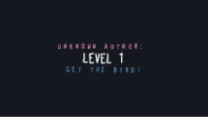
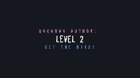
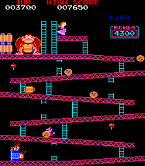
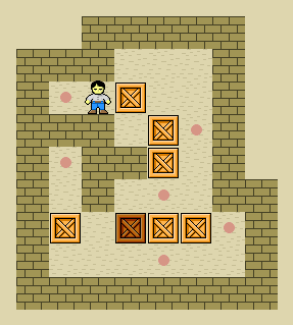
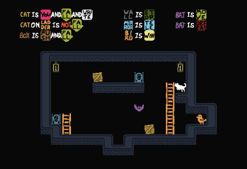
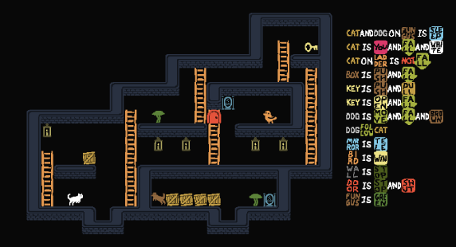
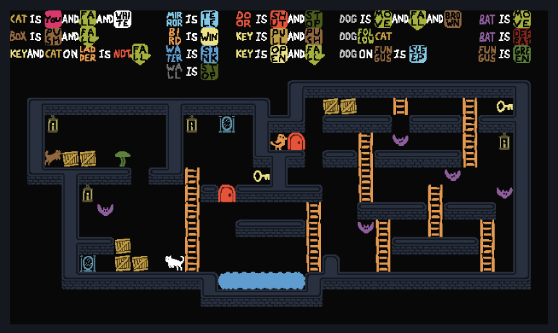

# Puzzles---Baba-Is-You

**Github project page**: [https:///github.com/Jowy02/Motor-Grafico](https:///github.com/Jowy02/Puzzles---Baba-Is-You)

## Description

In this design project, we used the level editor from the game *Baba Is You* to create our own levels based on the Kishotenketsu progression, gradually introducing new mechanics.

## Trailer/Demo

<table>
  <tr>
    <td align="center">
      
    </td>
    <td align="center">
      
    </td>
    <td align="center">
      
    </td>
  </tr>
</table>

<em>Click the images above to watch the full demonstration </em>

## Installation

We will show the code for every level we make on the sepcific part

## How to play
### Controls

     **↑** — Move forward
     **↓** — Move backward
     **↑ / ↓** — Climb up/down stairs
     
## Inspiration

“Baba Is You” is a puzzle game in which the rules you must follow are represented by blocks that you can interact with. By manipulating these blocks, you can change the course of the game. 

We wanted to take a different approach and use gravity as the main mechanic to put a new spin on it and turn it into a platformer. Our main inspirations were *Donkey Kong* (1981)—which blends the arcade platforming aspect very well with the visual style of *Baba Is You*—and *Soukoban* for the puzzles featuring pushable elements.

<table align="center">
  <tr>
    <th>Donkey Kong (1981)</th>
    <th>Sokoban</th>
  </tr>
  <tr>
    <td align="center">
      
    </td>
    <td align="center">
      
    </td>
  </tr>
</table>

## Level 1: Ki (Introduction)

    

<em>Level Code: ZNEM-TBCQ </em>

### **Level Objective**

Reach the bird (BIRD), located in the lower right corner of the level. The player controls the cat (CAT), which must navigate using ladders, boxes, and mirrors (teleporters), and avoid the bat (BAT) to reach the objective.

### **Design Objective**

To organically introduce the main mechanics that will be part of all subsequent levels. These are:
- Gravity
- Ability to climb stairs
- Boxes can be moved to access new areas
- Reach the bird = win
- Touch the bat = lose the game

### **Environmental Description**

The stage is divided into two levels:

- Upper level: The cat starts here, next to a box and a mirror.
- Lower level: Contains the bird (target), the ladder, the bat (which causes a game over if touched), and another box.
  
The mirrors connect both areas, and the boxes can fall, forming platforms or making it easier to control your descent.

## Level 2: Sho-Ten (Extra Complexity)

    

<em>Level Code: ZNEM-TBCQ </em>

### **Level Objective**

The player controls the cat (CAT), which must navigate using ladders and boxes to reach the key. Then, the cat must open the door and reach the bird (BIRD), avoiding the mushroom (MUSHROOM) to complete the level. The dog (DOG) will chase the cat, helping to carry the boxes so the player can use them.

### **Design Objective**

Gradually increase the difficulty of the level compared to the previous one. Additionally, introduce new mechanics and explain how they interact with those already introduced in previous levels.

### **Environmental Description**

The level consists of several rooms connected to one another by vertical staircases. The dog and several boxes—which can be used as platforms—are located at the bottom. To obtain the key, open the central door, and reach the bird, the player must climb up and down between platforms and use the dog to pass the boxes to
their area. There are hazardous areas, such as mushrooms, that force the player to carefully plan their route.

## Level 3: Ketsu (Consolidation)

    

<em>Level Code: 6XF1-RH14 </em>

### **Level Objective**

This scenario is more extensive and complex, as it brings together all the mechanics learned in the previous levels. The player controls the cat (CAT) and, to complete the level, must reach the bird (BIRD), avoiding obstacles such as water (WATER) and bats (BAT), and using the dog (DOG), the mushroom (MUSHROOM), keys, ladders, and doors to progress.

### **Design Objective**

The design aims to assess the player’s comprehensive understanding of the rules and their ability to combine all the elements they have learned:
- Planning the path using ladders (LADDERS).
- Coordinating with the dog (DOG) and using the mushroom (MUSHROOM).
- Strategic use of the door (DOOR) and the key (KEY).
- Simultaneously avoiding threats (BAT, WATER).

### **Environmental Description**

The stage is spacious and divided into three main sections connected by staircases and hallways. At the bottom of the map is a pool of water (WATER) that acts as a deadly obstacle. The key (KEY) is located on a higher level and is protected by bats (BAT) that patrol horizontally, while the door (DOOR) blocks the path to the bird (BIRD). The dog (DOG) can help move crates in the upper-left corner. The teleporter (MIRROR) allows you to move crates to areas and in ways that would otherwise be impossible.

## Credits
**All contributors working on this project**:

_Joel Vicente_ « **Github**: [Jowy02](https://github.com/Jowy02)

_Arthur Cordoba_ « **Github**: [000Arthur](https://github.com/000Arthur)

_Jana Puig_ « **Github**: [JanaPuig](https://github.com/JanaPuig)

_Albert Frederic_ « **Github**: [JanaPuig](https://github.com/Fredi223)
